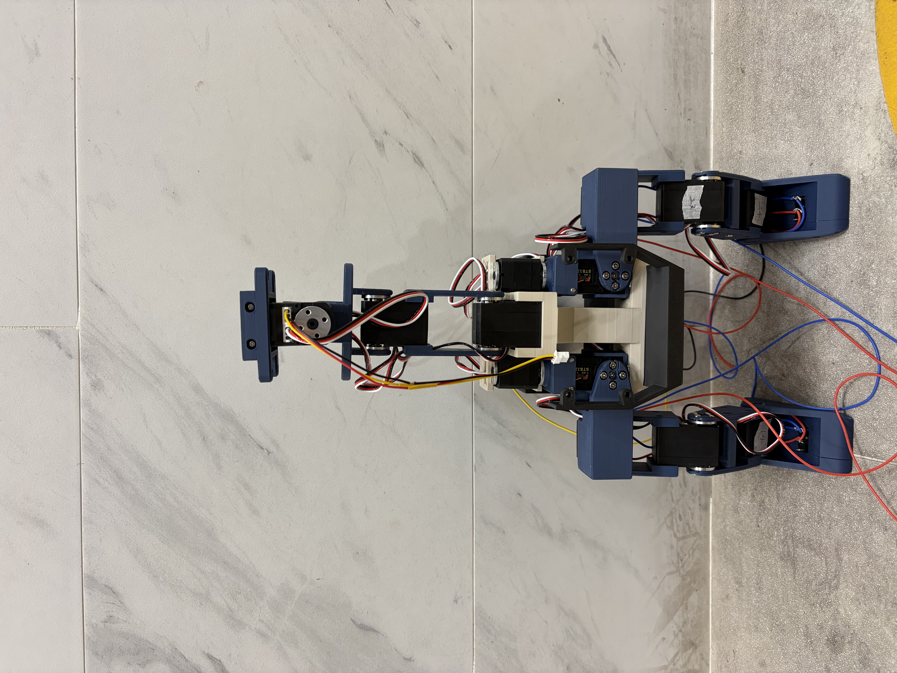
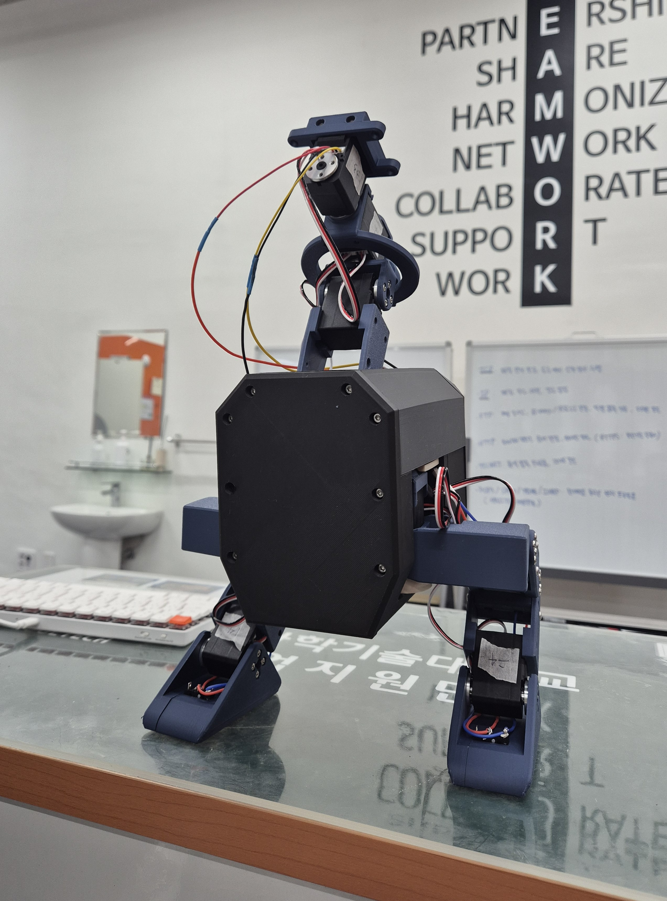
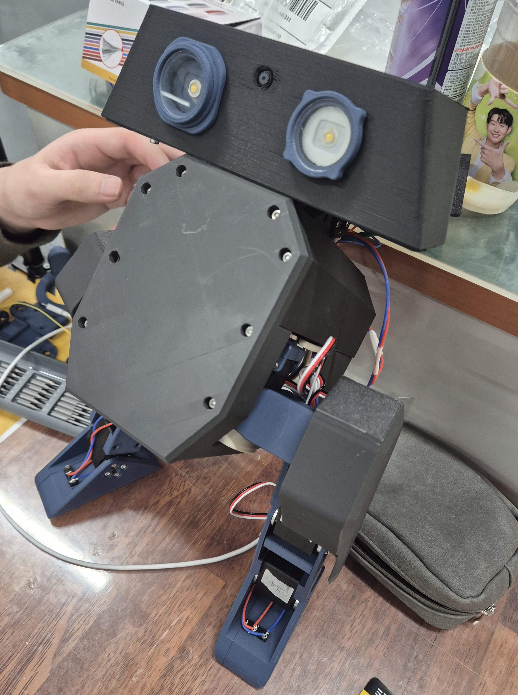
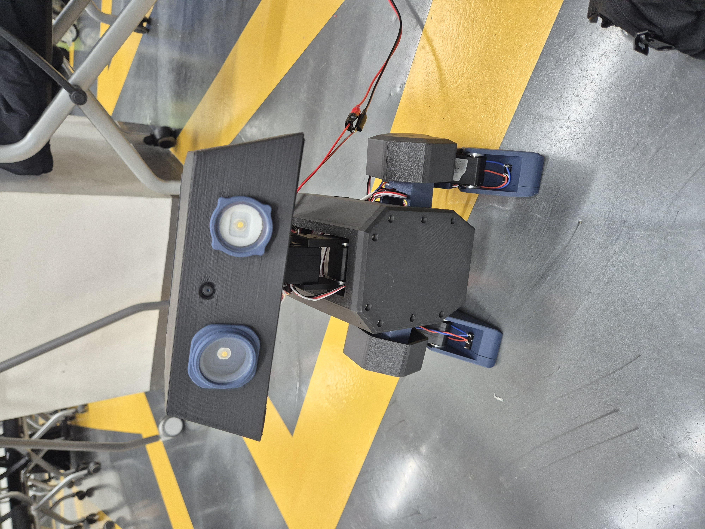
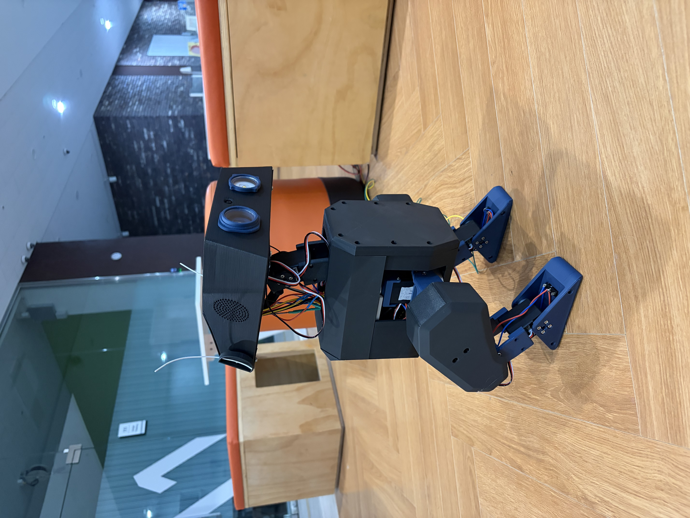
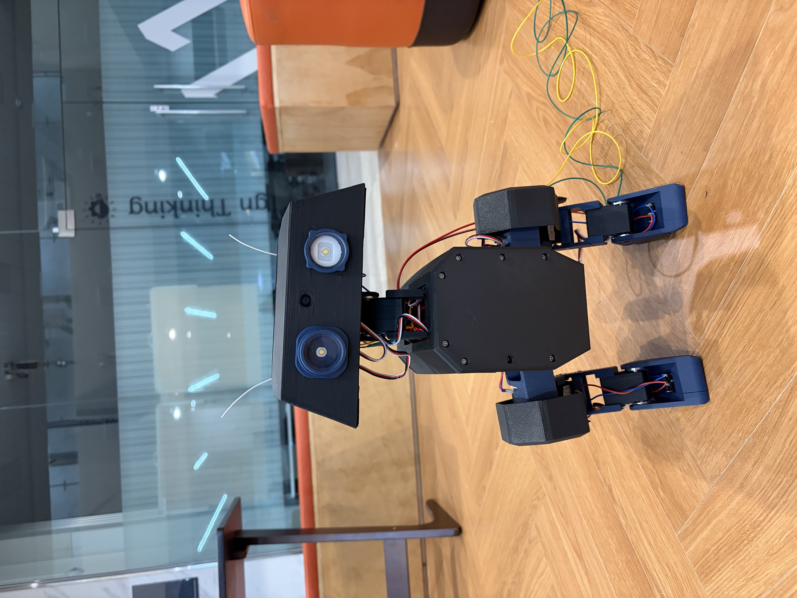
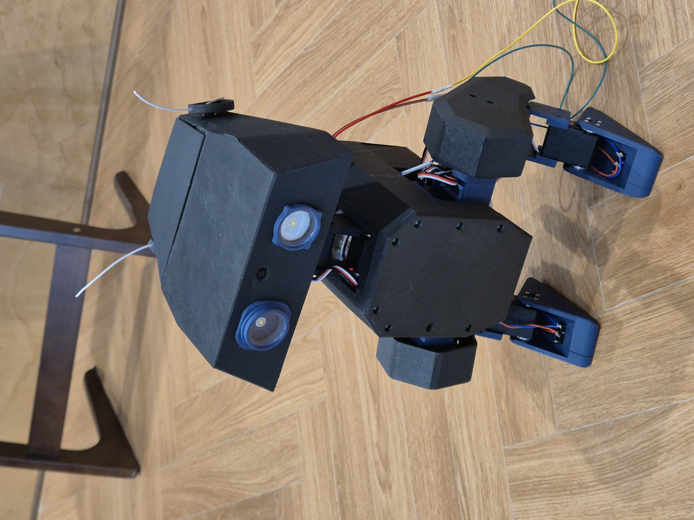

# Open Duck Mini — Build Log
> This is our personal build record for assembling and running the Open Duck Mini bipedal robot.<br>
> Original project: [apirrone/Open_Duck_Mini](https://github.com/apirrone/Open_Duck_Mini)

---

## Who We Are

| Person | Role |
|--------|------|
| [igeoni](https://github.com/igeoni) | Hardware assembly, components wiring, 3D printing |
| [gwlim3012](https://github.com/gwlim3012) | Embedded software setup, Sensor calibration |
- RL policy testing done together.<br>
- Planning to train our own Sim2Real policy from scratch.
---

## Hardware
 
> For the full BOM and assembly guide, refer to the [official docs](https://github.com/apirrone/Open_Duck_Mini/tree/v2/docs).
 
- Raspberry Pi Zero 2W
- Dynamixel XL-330 motors × 14
- IMU (BNO085)
- DualSense (PS5) controller
- Custom 3D-printed frame (STLs in official repo)
 
---

## Software Setup
 
> Refer to [apirrone/Open_Duck_Mini_Runtime](https://github.com/apirrone/Open_Duck_Mini_Runtime) for all embedded software details.
 
### OS
 
- **Raspberry Pi OS Lite 64-bit — Bookworm** 
 
### Install
 
```bash
sudo apt update && sudo apt upgrade
sudo apt install git python3-pip python3-virtualenvwrapper
```
 
Add to `~/.bashrc`:
 
```bash
export WORKON_HOME=$HOME/.virtualenvs
export PROJECT_HOME=$HOME/Devel
source /usr/share/virtualenvwrapper/virtualenvwrapper.sh
```
 
Enable I2C: `sudo raspi-config` → Interface Options → I2C
 
Set USB serial latency:
 
```bash
cd /etc/udev/rules.d/
sudo touch 99-usb-serial.rules
sudo nano 99-usb-serial.rules
# Add: SUBSYSTEM=="usb-serial", DRIVER=="ftdi_sio", ATTR{latency_timer}="1"
```
 
### Runtime
 
```bash
mkvirtualenv -p python3 open-duck-mini-runtime
workon open-duck-mini-runtime
 
git clone https://github.com/apirrone/Open_Duck_Mini_Runtime
cd Open_Duck_Mini_Runtime
git checkout v2
pip install -e .
```
 
### duck_config.json
 
```bash
cp example_config.json ~/duck_config.json
```
 
Our config is committed at `duck_config.json` in this repo for reference.
 
> Note: always pass the path explicitly to avoid "config not found" errors:
> `--duck_config_path ~/duck_config.json`
 
Set `"imu_upside_down": true` — IMU is physically mounted upside down on this build.
 
### Run
 
Download [BEST_WALK_ONNX_2.onnx](https://github.com/apirrone/Open_Duck_Mini/blob/v2/BEST_WALK_ONNX_2.onnx) and place it under `scripts/`.
 
```bash
cd scripts/
python v2_rl_walk_mujoco.py \
  --onnx_model_path ./BEST_WALK_ONNX_2.onnx \
  --duck_config_path ~/duck_config.json
```

## Troubleshooting
 
### Debian Trixie dependency errors
- `pip install` fails with package conflicts
- Re-flash SD card with **Raspberry Pi OS Bookworm**
 
### `duck_config.json` not found issue
- Script defaults to `~/duck_config.json` — pass path explicitly:
  ```bash
  --duck_config_path ~/duck_config.json
  ```
 
### Xbox One controller Bluetooth
- Failed to pair on Pi Zero 2W — switched to **DualSense (PS5)**

---
 
## Photos

### Assembly
<table>
  <tr>
    <td></td>
    <td></td>
  </tr>
  <tr>
    <td></td>
    <td></td>
  </tr>
</table>

### Final Build
<table>
  <tr>
    <td></td>
    <td></td>
    <td></td>
  </tr>
</table>

### Video
https://github.com/user-attachments/assets/c1091f3d-5a8f-431f-83e2-302207438d62.mp4

Walking isn't smooth yet. We're looking into retraining the model or a hardware overhaul to fix the gait.
